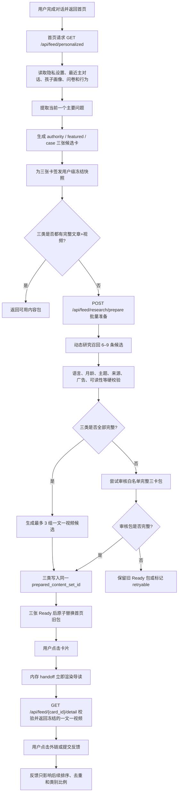

# NURI `daniel-test` 技术交接（2026-08-04）

> 本文记录从测试支线重新对齐主线之后，到当前推荐卡片版本完成本轮测试为止的全部重要更新，并重点说明当前推荐系统如何在已发布 Ready 内容包的正常路径上做到：内容与最新对话相关、符合孩子阶段、三张卡价值不同、中文资源质量可控、点击后立即看到已经准备完成的文章和视频。

## 0. 文档信息与当前状态

| 项目 | 当前值 |
| --- | --- |
| 记录日期 | 2026-08-04（America/Chicago） |
| Git 仓库 | `https://github.com/Daniel777611/Nuri.git` |
| 固定迭代支线 | `daniel-test` |
| 本轮主线同步点 | `0c543b384d0a579d48589fe412183e8a6407330f`（`0c543b3`） |
| 本轮应用实现提交（不含本文档提交） | `8d5fee93efb3d2ddfa55c2d1115577ab90df5834`（`8d5fee9`） |
| 应用实现相对 `origin/main`（不含本文档提交） | 0 behind / 34 ahead |
| 应用实现累计代码变化（不含本文档） | 40 个文件，31,709 行新增，1,694 行删除 |
| 固定线上测试地址 | <https://nuri-test-ordashtech.vercel.app/> |
| Vercel 项目 | `ordashtech/nuri` |
| Vercel Project ID | `prj_s6Z314MR862nZyjWsGvcquj3Aiyo` |
| 当前固定测试部署状态 | Ready |
| 当前健康检查 | `/health` 返回 `{"ok":true,"supabase":true,"vector_store":"supabase","openai":true}` |

### 0.1 分支边界

- Git reflog 明确记录：2026-07-30 22:25:35（-0500），`daniel-test` 执行 `reset: moving to origin/main`，落在 `0c543b3`。因此本文的起点不是根据提交名推测，而是可复核的实际同步点。
- `0c543b3` 的 tree 与交接时 `origin/main` tree 完全一致，说明当时确实以主线内容完整覆盖了测试支线本地代码。
- 本轮所有产品迭代都发生在 `daniel-test`。
- 没有合并、推送或部署 `main`，也没有改动其他支线。
- `origin/main` 仍在 `0c543b3`；当前 `daniel-test` 比主线多 34 个提交。
- 后续除非产品负责人明确要求，不得把本轮内容推送到主线。
- 本地 `main` 指针可能落后，比较时必须先 `git fetch origin`，并使用 `origin/main`，不要使用未更新的本地 `main`。

`/health` 当前只证明相关配置/客户端已初始化，并报告向量存储配置为 Supabase；它不是对数据库查询、向量查询和 OpenAI 请求的端到端连通性探测。真实依赖可用性仍要由 API smoke/E2E 验证。

### 0.2 当前工作区中必须保留的用户文件

以下文件在交接时为未跟踪用户文件，不属于本轮提交，禁止删除、覆盖或用 `git add .` 意外提交：

- `design-qa.md`
- `test_reports/home-last-conversation-20260730.png`
- `test_reports/quick-replies-reference-20260730.png`
- `test_reports/quick-replies-removed-20260730.png`

---

## 1. 一句话结论：最后采用了什么架构

最终不是一个“用户点卡片后，再让 AI 临时搜索网页”的系统，也不是单纯在代码里硬编码几条链接。

当前采用的是一套 **混合式、预生成、可审计的个性化内容交付架构**：

1. 读取最新主对话、孩子实时月龄、账号语言、问卷偏好和有限的历史行为。
2. 先确定当前用户最需要解决的一个主要问题，而不是把长对话里的所有主题混在一起。
3. 围绕同一个问题，分别生成三张价值不同的卡片：权威答案、精选方法、相似案例。
4. 每一类都只允许从对应的来源分道中召回候选；不能因为一个机构“看起来权威”就用于所有分类。
5. 在线研究结果必须经过语言、月龄、主题、来源身份、链接、广告、视频实质性、案例可读性等硬门槛。
6. 在线研究失败或结果不完整时，优先整套回退到逐条审核且能组成完整三卡的白名单内容；若审核库存也无法组成完整包，则保留旧 Ready 包或标记可重试，而不是发布半成品。
7. 已发布 Ready 套装中的三张卡在首页展示前已经准备好，并作为同一个内容包一次性发布。
8. 首页刷新期间继续显示上一套可用内容；新套装三张都 Ready 后才原子替换。
9. 用户点击 Ready 卡片时直接打开已经冻结的内容包，不再走旧式单卡现场搜索；极端冷启动且没有可用审核包时，卡片会诚实显示 preparing/retryable，并可能等待同一批量 prepare。
10. 点击、停留、收藏、换一组、不相关、语言错误等反馈，只调整未来排序和比例，不能凌驾于最新对话相关性。

因此，当前体验的核心不是某一个模型，而是：

> **对话驱动的内容理解 + 三分道编辑合同 + 动态研究与人工审核库存的混合召回 + 硬质量门槛 + 预生成内容包 + 加密快照 + 原子发布 + 行为反馈。**

这仍是一个可解释的 MVP 推荐系统，不是 YouTube 规模的跨用户协同过滤或深度 CTR 模型；在本轮已经准备完成的测试内容包上，它达到了当前最重要的体验目标：更相关、来源可解释、中文可用、可读、Ready 卡片点击即得。

---

## 2. 当前用户实际看到的产品体验

### 2.1 首页推荐区

在 `presentation=category_cards` 的个性化首页视图中，固定有三张推荐卡，并且三张卡围绕同一个最新问题：

1. **权威答案（authority）**
   - 告诉用户这个阶段通常是什么情况。
   - 给出发展里程碑、值得观察的信号和何时应咨询专业人士。
   - 来源是政府、大学、儿童医院、医学组织、专业期刊等。

2. **精选方法（featured）**
   - 告诉用户今天具体可以怎么做。
   - 优先高可读性、信息密度高、可执行的医生/专家/优质育儿平台和专业创作者内容。
   - 核心事实必须与权威证据一致，但表达可以更轻、更实用。

3. **相似案例（case）**
   - 告诉用户处境相似的父母实际经历了什么、试了什么、怎么调整、结果如何。
   - 来源优先真实家长记录、审核过的家庭内容和有实质过程的父母创作者视频。
   - 必须明确它是单个家庭经验，不代表普遍效果或医学建议。

三张卡不再只是换颜色和来源名。每张卡有不同的收益型标题、推荐理由、来源、语言、预计时间和适用阶段。

### 2.2 内容语言

- 简体中文用户优先得到英语权威机构提供的官方简体中文版本。
- 没有官方简中时，允许把英文权威原文作为 NURI 中文导读的证据底稿，但不能把 NURI 导读冒充成“官方翻译”。
- 简中视频必须是普通话；英文或粤语视频不能作为简中用户的最终视频交付。
- 再下一层使用经过审核的大陆简中专业平台、台湾普通话内容或可读性良好的繁中内容，并在界面如实标注。
- 繁中用户优先台湾官方、公立医院和繁体中文资源。
- 英文用户优先英文原始来源。

### 2.3 点击卡片后的详情页

用户点击已发布的 Ready 卡片后，直接看到：

- 一段 NURI 中文导读；
- 为什么这组内容适合当前家庭；
- 一篇已经审核并准备完成的文章；
- 一个已经审核并准备完成的视频；
- 1–3 个今天可以做的小行动；
- 来源、作者/机构、可信度、语言、音轨和适用阶段说明；
- “有帮助 / 不相关 / 语言不对 / 广告太多 / 看过了 / 换一组”等反馈入口。

详情页不再是搜索页，不应出现“用户点进来后才开始实时搜索”的主路径。

冷启动且不存在旧 Ready 包或完整审核回退时，系统会如实处于 preparing/retryable；此时点击可能等待同一个三卡批量 prepare。它与已被移除的“每张卡点击后各自现场搜索”是两条不同路径。

### 2.4 返回首页后的刷新

- 用户完成一段有实质内容的对话并退出到首页后，前端发送刷新信号。
- 首页重新加载最新对话上下文并开始准备新推荐。
- 如果新内容还在准备，上一套完整内容继续显示、继续可点。
- 新的三张卡全部准备好以后才一起替换，不需要浏览器手动刷新。

---

## 3. 从主线同步后完成了哪些更新

本轮从 `origin/main@0c543b3` 开始，按产品演进可分为六个阶段。

### 3.1 阶段 A：恢复干净基线并修复基础交互

对应提交 1–4。

完成内容：

- 去掉聊天底部的快捷问题按钮，避免 AI 回复后继续出现产品不需要的快捷问题。
- 确保支线先恢复到主线基线，再只保留目标修改。
- 首页“Nuri 的家”不再显示静态文案，而是关联用户真实最近一次主对话。
- “继续对话”进入真实上次会话。
- 修复任务卡生成：
  - AI 给出明确可执行方案后可以生成任务建议；
  - 用户明确要求“给我任务”时可以生成任务；
  - 修复任务建议接受、落库和首页展示链路。

主要文件：

- `frontend/app/chat/[id].tsx`
- `frontend/app/(tabs)/index.tsx`
- `backend/main.py`
- `backend/tests/test_main_chat_preview.py`
- `backend/tests/test_task_suggestions.py`

### 3.2 阶段 B：让推荐与真实对话关联，并加入多语言内容目录

对应提交 5–10。

完成内容：

- 首页学习推荐开始读取最近对话，而不是固定展示同一批主题。
- 修复“聊语言却推荐情绪”“长对话只命中旧主题”等相关性错误。
- 建立简体中文、繁体中文和英文资源元数据。
- 简中最初优先大陆以外权威中文资源；繁中优先台湾来源。
- 详情页从单条静态内容扩展为带来源、文章、视频和标签的学习目录。
- 建立第一版静态审核内容库，为后续动态研究提供可靠回退。

主要文件：

- `backend/content_library.py`
- `backend/main.py`
- `backend/tests/test_personalized_feed.py`
- `frontend/app/detail/[id].tsx`
- `frontend/src/preview-api.ts`

### 3.3 阶段 C：引入对话研究、画像、行为反馈和三类卡片

对应提交 11–19。

完成内容：

- 新增在线内容研究管线 `backend/content_research.py`。
- 不再只依赖有限的静态主题，而是能对新的育儿问题做受控外部研究。
- 建立长对话排序策略：最新明确问题优先，旧主题降权，重复关切有适度加成。
- 过滤“推荐不准”“换一个”等产品反馈，避免它们被误识别为育儿主题。
- 新增推荐快照和行为反馈模块。
- 孩子月龄改为根据生日实时计算，解决用户填了生日但界面仍使用陈旧月龄的问题。
- 孩子画像、问卷偏好、账号语言进入推荐上下文。
- 首页由一个泛推荐轮播改为三类卡片：权威、精选、案例。
- 问卷和行为只决定首卡和未来比例，不会删除其他类别。

新增核心模块：

- `backend/content_research.py`
- `backend/recommendation_snapshots.py`
- `backend/recommendation_feedback.py`
- `frontend/src/child-age.ts`
- `supabase/recommendation_events_migration.sql`

### 3.4 阶段 D：退出对话即刷新、提前准备并可靠打开

对应提交 20–23。

完成内容：

- Chat 返回首页时传递刷新 nonce；首页 focus 后立即重新请求推荐。
- 建立 `POST /api/feed/research/prepare` 批量准备接口。
- 修复准备中断、重复请求和并发准备。
- 建立前端共享 preparation promise，避免同一套推荐同时发起多次准备。
- 建立详情页内存 handoff，点击卡片后先立即渲染导读，再和后端快照核对。
- 修复卡片点了以后卡在“正在搜索”、不断重试或根本进不去的问题。

主要文件：

- `frontend/src/feedPreparation.ts`
- `frontend/src/recommendationDetailHandoff.ts`
- `frontend/scripts/test-recommendation-entry-contract.mjs`
- `backend/tests/test_feed_prepare_failures.py`

### 3.5 阶段 E：把推荐变成完整内容包，并建立正式白名单和交付合同

对应提交 24–27。

完成内容：

- 明确“一次推荐只围绕一个主要问题”。
- 三张首页卡围绕同一问题，但交付三个不同视角。
- 每张详情固定为一篇文章 + 一个视频。
- 新内容必须在首页出现前准备完成。
- 建立一个内容包的 `prepared_content_set_id`，三张卡必须属于同一个完整套装。
- 增加正式来源白名单和内容交付合同：
  - `doc/content_source_whitelist_v0_9.md`
  - `doc/recommendation_delivery_contract_v0_1.md`
- 修复来源分道、语言回退、详情页标签和说明文案。
- 从产品层明确：白名单只是候选准入，不等于整站自动放行，也不等于用户最终一定看到。

### 3.6 阶段 F：安全 E2E 与中文/案例质量硬化

对应提交 28–34。

完成内容：

- 增加真实登录的 Playwright E2E，并保证密码不进入代码、命令历史、截图、trace 或 storage state。
- 简中用户优先：
  - 英文权威机构的官方中文；
  - 普通话实质视频；
  - 大陆专业平台和优质中文内容；
  - 审核过的繁中/台湾普通话回退。
- 精选分类强调可读性、实用性和信息密度，不再用联合国宣传类内容充当精选。
- 权威视频禁用没有实际知识内容的 UNICEF 宣传片。
- 案例分类的编辑目标是完整呈现：问题 → 尝试 → 调整 → 结果；当前代码硬 gate 至少验证真实父母/第一人称身份，以及做法、调整或结果中的一个过程信号。
- 案例文章优先现代、移动端可读的育儿平台或逐条审核的真实父母页面。
- 案例视频必须是实质性的父母经验，不允许公益广告或宣传片。
- PTT 等粗糙旧论坛页面被硬拒绝为用户可见案例文章。
- 堵住默认路径、未分类路径和研究回退路径绕过案例质量门槛的问题。
- 新内容准备期间继续保留上一套已审核、可用内容，不再把首页退化成等待页。

最终两个质量修复提交：

- `267a4df` — Reject low-readability case article pages
- `8d5fee9` — Close legacy case article bypass

---

## 4. 最终技术架构总览



### 4.1 技术栈

- 前端：Expo Router + React Native Web + React 19。
- 后端：FastAPI，Vercel Python Function 入口 `api/backend.py`。
- 数据与认证：Supabase。
- 动态内容研究：OpenAI Responses/API 研究管线，默认模型 `gpt-5.4-mini`。
- 推荐快照加密：Fernet，对用户与上下文进行绑定。
- 部署：Vercel Preview；当前固定测试别名指向本轮 Ready Preview。
- E2E：Playwright。

---

## 5. 推荐输入：系统到底读取了什么

### 5.1 最近主对话

核心函数：`backend/main.py::_load_recent_main_chat`。

读取规则：

- 当前主会话保留最近的用户和 AI 消息，用于理解上下文。
- 跨会话历史只使用用户自己的消息，不让旧 AI 文案反过来“制造”用户兴趣。
- 当前会话最多取约 24 条，跨会话最多 5 个会话、18 条历史用户消息。
- 排除由推荐卡片进入的附属聊天，避免推荐内容自我强化。
- 关闭历史个性化、鉴权失败或隐私状态不确定时 fail closed，不加载历史。

### 5.2 孩子发展阶段

核心函数：

- `backend/main.py::_age_label`
- `backend/main.py::_attach_child_recommendation_context`
- `frontend/src/child-age.ts`

月龄根据生日实时计算，处理月末和闰日边界。孩子生日不会原样送入外部研究；外部只获得类似“9 个月”这样的阶段标签和匿名画像摘要。

孩子新增、删除或编辑后：

- 画像 fingerprint 改变；
- 旧推荐快照不再通过校验；
- 下一次推荐会按新的月龄和画像重新生成。

### 5.3 问卷冷启动偏好

注册问卷中的 `help_preference` 和 `info_source` 形成最初先验。例如：

- 更想看专业研究；
- 更想看真实父母经验；
- 更想一步一步分析；
- 更想直接得到可执行方法。

这组先验决定哪一类卡片优先展示，但三类卡片始终存在。

### 5.4 账号语言和外部研究授权

关键设置：

- `language`: `zh-CN` / `zh-TW` / `en`
- `allow_external_content_research`: 是否允许对外研究

外部研究没有获得明确授权时，系统只使用已审核白名单内容，不把对话摘要发送给研究模型。

### 5.5 行为反馈

最近 30 天的行为用于轻量调整：

- impression / open；
- 详情停留；
- 外部文章或视频点击；
- 收藏、继续聊；
- helpful / not relevant；
- 换一个；
- 语言不对、广告太多、已经看过。

行为信号只能重排已经被当前对话证明相关的内容，不能让一次旧点击盖过用户刚刚明确提出的新问题。

---

## 6. 对话主题识别和排序

核心函数：`backend/main.py::_rank_learning_content`。

当前排序原则：

1. 最新一条有实质内容的用户请求最高。
2. 最近几条用户消息用于补充约束，例如孩子月龄、父亲创业忙、陪伴时间少。
3. 旧会话里的重复关切可以增加置信度，但权重低于最新明确问题。
4. AI 历史回复只能帮助消歧，不能凭 AI 自己提到的主题推断用户兴趣。
5. 过滤以下内容：
   - 寒暄；
   - “推荐卡不准”“换一个”等产品反馈；
   - 对 NURI 的界面、推荐或模型进行评价；
   - 没有家庭事实的元问题。
6. 如果静态主题库没有对应主题，但用户确实提出育儿问题，则创建受控的动态研究卡。
7. 排序层在置信度不足时不强行制造 eligible topic；如果新内容包尚未 Ready，交付层继续保留上一套 Ready 推荐。

这套排序解决过的典型错误：

- 用户聊语言发展，却推荐情绪调节；
- 长对话中一直推荐最早的“关键期”，忽略最后提出的“创业忙、陪伴时间少”；
- 用户说“推荐不准确”，系统把“不准确”当成新的育儿主题。

---

## 7. 三条内容分道的编辑合同

正式产品合同见：`doc/recommendation_delivery_contract_v0_1.md`。

### 7.1 权威答案分道

允许来源：

- 美国 CDC、AAP / HealthyChildren、NIH / MedlinePlus；
- Harvard、Stanford、ASHA、CHOP、Mayo Clinic；
- 其他政府、大学、公立儿童医院、医学组织和经过核验的专业期刊；
- 台湾卫福部门、公立医院；
- 香港卫生署和公立医疗体系；
- 经过审核的大陆公立儿童医院和专业医学机构。

强规则：

- 必须证明真正的发布机构身份，不能把 YouTube 当成 publisher。
- 简中优先同一权威机构提供的官方中文版本。
- 视频必须包含实际知识内容，不允许纯宣传、募捐、品牌片或预告。
- 当前明确禁止 UNICEF 宣传型视频进入权威视频交付。

### 7.2 精选方法分道

允许来源：

- 丁妈/丁香医生/丁香妈妈等有作者、审校和日期的专业内容；
- 高可读性育儿平台；
- 经过审核的医生、心理师、营养师和专业育儿创作者；
- Raising Children Network 等高质量家长友好平台；
- 精确审核过的 YouTube、B 站或小红书单条内容。

精选的重点不是“机构看起来大”，而是：

- 一打开就容易读懂；
- 信息密度高；
- 有清楚步骤；
- 与家庭现实约束匹配；
- 没有广告导流；
- 核心事实有权威证据锚点。

UNICEF 被禁止进入精选分道，避免把机构宣传内容误当作高可读性方法。

### 7.3 相似案例分道

案例的编辑目标是包含真实过程：

- 家庭遇到了什么问题；
- 尝试了什么；
- 哪些没奏效；
- 如何调整；
- 最后发生了什么。

允许来源优先级：

- 逐条核验的真实父母文章；
- 宝宝树、mama.cn、妈妈宝宝、MamiBuy、Mamilove、亲子天下、MommyCarry 等可读性较好的具体页面；
- 小红书具体创作者的具体公开笔记；
- YouTube 上有长期育儿内容、实质过程且非广告的真实父母创作者；

强规则：

- 政府、大学、医院、医学组织不能仅凭权威身份冒充“真实父母案例”。
- PTT 等旧式论坛页面不再允许作为用户可见案例文章。
- 社交平台按“具体创作者 + 具体内容 + 精确 URL”审核，不能整站放行。
- 小红书页面若受登录墙限制或无法稳定验证，不能猜 URL，也不能进入自动交付。
- 案例必须标注“单个家庭经验，不代表普遍效果或医学建议”。

当前确定性代码 gate 的实际强度是：验证家庭/第一人称身份信号，且至少出现做法、调整或结果中的一个过程信号，并要求 `case_process_status=verified`。问题、尝试、失败、调整、结果五段全部齐全是编辑合同和审核目标，尚不是五个字段分别被机器证明的硬保证。

---

## 8. 混合召回：为什么既有自动化又不完全依赖人工

当前不是纯人工内容库，也不是任意联网搜索，而是三层混合召回。

### 8.1 第一层：审核资源库存

文件：`backend/content_library.py`。

库存保存：

- 精确 URL；
- publisher 和 `parent_org_id`；
- 文章/视频类型；
- 内容类别；
- 来源等级；
- 简中/繁中/英文；
- 普通话/英文/不适用音轨；
- 翻译类型；
- 适用月龄和主题标签；
- 可信度说明；
- 受认可程度；
- 入选理由；
- 广告/实质内容/案例过程状态。

它是在线研究失败时的可靠下限，也为常见主题提供即时可交付内容。

### 8.2 第二层：受控动态研究

文件：`backend/content_research.py`。

研究输入不是整段原始聊天，而是经过脱敏和结构化的上下文：

- 当前主要问题；
- 孩子阶段；
- 家庭约束；
- 目标类别；
- 内容和音轨语言；
- 近期已交付的 canonical public URL（去除跟踪参数）和结构化反馈 reason code；
- 白名单和禁入规则。

默认配置：

- 模型：`gpt-5.4-mini`；
- 每次 OpenAI API call 超时上限：30 秒；一次 prepare 可能包含修复或备用候选调用，因此端到端不是 30 秒，前端 prepare timeout 约 110 秒；
- 并发：2；
- 每类候选：2–3 条；
- 完整研究包：6–9 条；
- 正结果进程内缓存：6 小时；Vercel 冷启动和多实例之间不共享；
- 失败缓存：180 秒；
- 缓存最大 128 项。

### 8.3 第三层：确定性审核与发布门槛

模型找到候选以后不能直接展示。后端会再次执行确定性规则：

- HTTPS；
- 链接和直达 URL 合法；
- 来源身份可证明；
- 类别匹配；
- 主题和月龄匹配；
- 内容语言匹配；
- 视频音轨匹配；
- 无明显广告、课程、问诊、药品或商业导流；
- 视频不是宣传片、预告或残缺片段；
- 精选内容可读、可执行；
- 案例通过当前第一人称/家庭身份和过程信号 gate；
- 案例页面具有可接受的阅读体验；
- 不重复近期已交付 URL；
- 同一机构不过度占据内容包。

任何一个类别没有完整的一篇文章和一个视频，动态包就不能发布。

---

## 9. 白名单的正确含义

正式白名单见：`doc/content_source_whitelist_v0_9.md`。

白名单回答的是：

> 哪些机构、栏目、创作者或具体内容可以进入候选池？

它不表示：

- 一个域名下所有页面都可信；
- 一个博主所有视频都适合；
- 权威机构的宣传片也有知识价值；
- 某条内容进入候选后一定会推给用户；
- 同一个来源可以同时填满三张卡。

当前重要原则：

- 权威机构可以按严格入口召回，但仍要检查具体页面。
- 医疗、诊断、药物、疫苗和急症内容需要更高等级审核。
- 社交平台、宝宝树、mama.cn 等只做单条精确放行。
- 同一机构的英文、中文、官网和 YouTube 账号共享一个 `parent_org_id`。
- 同一内容的转载、剪辑和翻译版本只算一条。

### 9.1 当前几个明确的硬编码质量边界

- `FEATURED_FORBIDDEN_PARENT_ORG_IDS`：UNICEF 禁止进入精选。
- `AUTHORITY_VIDEO_FORBIDDEN_PARENT_ORG_IDS`：UNICEF 宣传视频禁止进入权威视频。
- `CASE_FORBIDDEN_PARENT_ORG_IDS`：权威机构集合不能自动作为案例来源。
- `CASE_ARTICLE_BLOCKED_USER_FACING_HOSTS`：`ptt.cc` 不得作为用户可见案例文章。
- `REVIEWED_EXACT_RESOURCE_URLS`：社交/育儿平台必须精确到人工核验 URL。

历史内容库中仍可能保留 PTT 记录用于回归测试或旧数据兼容，但当前所有用户可见选取路径都会执行二次 gate，不能把它交付给用户。

---

## 10. 语言交付策略

核心函数：`backend/main.py::_delivery_locale_priority`，并由 `content_research.py` 的语言硬门槛再次校验。

### 10.1 `zh-CN`

优先级：

1. 英语权威机构官网提供的官方简体中文文章。
2. 经核验的普通话权威视频或原创简中内容。
3. 大陆专业平台、公立儿童医院或优质中文来源。
4. 台湾普通话视频和经过审核的繁体中文内容，并如实标注。
5. 英文权威文章可作为 NURI 中文导读底稿，但不是最终“中文原文”。

硬限制：

- 简中用户不能收到英文视频作为最终视频。
- 有中文字幕不等于普通话音轨。
- 粤语视频即使有简中字幕，也不能标成普通话。

### 10.2 `zh-TW`

- 优先台湾政府、卫福部门、公立医院和繁中专业资源。
- 视频优先台湾普通话/华语。
- 香港粤语视频必须明确标注，不能静默混入普通话池。

### 10.3 `en`

- 优先英文原始权威来源和英文专业创作者。
- 不为了来源多样性而降级到不匹配语言。

语言优先级高于来源多样性。也就是说，不会为了让三张卡来自三个不同机构，给简中用户塞入一个无法理解的英文视频。

---

## 11. 个性化类别比例和探索

模块：`backend/recommendation_feedback.py`。

冷启动默认接近均衡：

- authority 34%
- featured 33%
- case 33%

问卷偏好会修改初始比例；近 30 天行为会继续轻量调整。

保护规则：

- authority 最低约 25%，保证可信底线。
- featured 和 case 各自至少保留约 12% 探索空间。
- 三类永远存在；比例只决定首卡和探索顺序。
- 首页首卡在 6 小时窗口内稳定，避免每次刷新乱跳。
- 显式“不相关”比单纯未点击权重更大。
- 浏览量、粉丝量和点赞量只是候选元数据中的弱信号；当前已实现的用户级强信号包括收藏、helpful/not relevant、详情停留、外部点击和继续聊。有效评论与视频完播仍是未来计划，不是当前事件模型已经记录的信号。

这不是跨用户的 YouTube 推荐模型。当前是：

- 内容相关性排序；
- 规则约束；
- 用户级轻量行为重排；
- 有探索下限的类别混合。

---

## 12. 提前准备、快照和原子发布

这是最终用户体验能够稳定的关键。

### 12.1 快照

模块：`backend/recommendation_snapshots.py`。

当前版本：

- snapshot schema：`5`
- context contract：`delivery-source-lanes-v8-case-reader-experience`
- source contract：`source-lanes-v5-case-reader-experience`
- snapshot TTL：90 天
- prepared content TTL：6 小时

快照绑定：

- user；
- card id；
- category；
- session；
- conversation cutoff；
- child profile fingerprint；
- locale；
- source contract version；
- recommendation id；
- prepared content set id。

只要语言、孩子画像、会话截止点、合同版本或内容包不一致，旧结果就会被拒绝，避免一个旧内容包误配给新对话或另一个用户。

快照通过 Fernet 加密后存入现有 `app_settings`。持久存储是事实来源，进程内存只是缓存。没有独立推荐快照表是当前 MVP 的技术折中。

### 12.2 批量准备

接口：`POST /api/feed/research/prepare`。

输入必须包含同一用户、同一冻结上下文下恰好三类卡片。

准备流程：

1. 校验三张卡的 recommendation id 和快照。
2. 如果已经存在同一 Ready 内容包，直接复用。
3. 如果允许外部研究且不是紧急场景，执行动态研究。
4. 要求 authority / featured / case 每类至少一篇文章和一个视频。
5. 动态结果任何一类不完整时，尝试整套回退到能通过 gate 的审核内容包；审核库存也不完整时保留旧 Ready 包或标记 retryable。
6. 不允许“两个动态类别 + 一个不相关旧类别”混拼。
7. 每类最多提前保存 3 组完整 article/video pair，支持“换一组”。
8. 三类共用同一个 `prepared_content_set_id`。
9. 三类全部写成 Ready 后，前端才接受新套装。

### 12.3 前端原子替换

首页 `frontend/app/(tabs)/index.tsx` 会检查：

- 是否恰好三类；
- 每类是否只有一个有效类别；
- 三类是否属于同一内容包；
- 每类是否都有完整文章和视频；
- recommendation id 是否有效。

只有全部成立才替换当前轮播。准备期间：

- 不显示阻断式全屏遮罩；
- 不把旧卡变成不可点击；
- 不出现半新半旧；
- 不因网络超时清空内容。

---

## 13. 卡片点击和详情交付

### 13.1 前端 handoff

模块：`frontend/src/recommendationDetailHandoff.ts`。

- 内存 TTL：15 分钟。
- 最多保留 12 个 handoff。
- 数据存取时 clone，避免页面之间意外共用可变对象。
- 点击首页卡片时先把卡片、导读和准备数据写入 handoff，然后立即导航。

这样即使详情 API 需要数百毫秒校验，用户第一屏也能立即看到导读，而不是空白或“正在搜索”。

### 13.2 详情接口

接口：`GET /api/feed/{card_id}/detail`。

后端会校验：

- 当前用户是否拥有 recommendation；
- card/category 是否匹配；
- session 和 context cutoff 是否匹配；
- child fingerprint 是否匹配；
- locale 是否匹配；
- source contract 是否匹配；
- content set 是否 Ready；
- resources 是否恰好一篇文章和一个视频；
- 两条资源是否属于当前分类且为 HTTPS。

外部文章和视频只有在用户点击具体资源时才打开，同时记录行为事件。

### 13.3 换一组

接口：`POST /api/feed/{card_id}/research`。

优先顺序：

1. 瞬时切换到同一个快照中已经预生成的 alternate pair。
2. 候选耗尽后，必要时在该请求内执行受限 live research；这不是持久后台任务，前端会继续保留当前 pair。
3. 补充失败时保留当前 pair，不清空详情。

产品合同目标是让已有候选的切换接近瞬时，而不是每次点击都等一次搜索。

---

## 14. 反馈、数据最小化和隐私

接口：`POST /api/recommendations/events`。

模块：`backend/recommendation_feedback.py`。

当前约束：

- 每用户最多保留 240 条事件。
- 事件保留 120 天。
- 最近交付 URL 的去重窗口约 30 天。
- 客户端上报的 URL 会规范化并哈希；服务器生成的 `resource_delivered` 事件为了后续去重会保存去掉跟踪参数的 canonical public URL。
- 不在推荐事件中存聊天原文、内容标题、邮箱、孩子姓名或用户资料文本。

推荐研究隐私：

- 原始对话不能直接进入外部研究 prompt 或 cache key。
- 精确生日、孩子姓名留在 NURI 内部。
- 对外只提供安全的结构化摘要和阶段标签。
- 没有外部研究授权时只走审核库存。
- 紧急医疗或安全信号出现时停止普通内容研究，转安全响应。
- 存储或隐私状态异常时 fail closed。

数据库迁移：`supabase/recommendation_events_migration.sql`。

如果推荐事件表尚未部署，代码有 `app_settings`/进程内回退，但持久性和可查询性较弱。交接后应确认测试 Supabase 是否已执行迁移。

---

## 15. 失败与降级矩阵

| 失败情况 | 当前行为 |
| --- | --- |
| 用户未授权外部研究 | 只使用审核白名单内容 |
| OpenAI 研究超时 | 使用失败短缓存；有完整审核包时整套回退，否则保留旧 Ready/标记 retryable |
| 动态结果少一个类别 | 动态包整体不发布；有完整审核三卡时回退，否则保留旧 Ready/标记 retryable |
| 某类只有文章没有视频 | 该内容包不 Ready，不交付半包 |
| 链接、语言或来源校验失败 | 候选剔除 |
| 新包仍在准备 | 首页继续显示旧的完整 Ready 包 |
| 准备请求中断 | 状态可重试；不会覆盖已经并发写入的 Ready 包 |
| 详情快照不匹配 | 返回冲突/不可用，不把旧内容硬套给当前用户 |
| “换一组”补充失败 | 保留当前可用 pair |
| 存储或隐私读取失败 | 不加载历史，不对外研究 |
| 紧急风险文本 | 关闭普通推荐研究，走安全响应 |
| 冷启动且没有可用审核包 | 诚实显示 preparing/retryable，不伪造外链 |

重要发布原则：

> 宁愿继续显示上一套经过审核的内容，也不把不完整、语言错误、广告、粗糙论坛或未经验证的链接推给用户。

---

## 16. API 契约

### 16.1 `GET /api/feed/personalized?presentation=category_cards`

用途：

- 加载个性化上下文；
- 选择一个主要问题；
- 返回 authority / featured / case 三张卡；
- 附加 recommendation snapshots；
- 标明哪些卡已经有完整资源。

### 16.2 `POST /api/feed/research/prepare`

用途：

- 一次批量准备三类卡；
- 动态研究或白名单回退；
- 原子发布一个完整 prepared content set。

### 16.3 `GET /api/feed/{card_id}/detail`

用途：

- 校验冻结上下文；
- 返回当前卡片已经准备好的导读、一篇文章和一个视频。

### 16.4 `POST /api/feed/{card_id}/research`

用途：

- 切换已准备候选；
- 必要时在该请求内执行受限 live research；
- 支持 `refresh=true` 和目标 pair。

### 16.5 `POST /api/recommendations/events`

用途：记录最小化的推荐曝光、点击、停留、反馈和换一组事件。

---

## 17. 核心代码地图

### 17.1 后端

| 文件 | 职责 |
| --- | --- |
| `backend/main.py` | FastAPI 路由、上下文装配、主题排序、三卡生成、准备、详情和反馈 API |
| `backend/content_library.py` | 审核资源、来源身份、精确 URL、分道禁入和案例可读性规则 |
| `backend/content_research.py` | 动态研究、结构化输出、候选校验、语言/来源/广告/案例质量 gate、缓存 |
| `backend/recommendation_snapshots.py` | recommendation id、冻结上下文、加密快照、prepared set、TTL 和并发安全 |
| `backend/recommendation_feedback.py` | 问卷先验、行为事件、类别比例、探索、冷却和去重 |

### 17.2 前端

| 文件 | 职责 |
| --- | --- |
| `frontend/app/(tabs)/index.tsx` | 首页 feed、focus 刷新、三卡完整性检查、后台准备和原子替换 |
| `frontend/src/components/HeroCarousel.tsx` | 三类推荐卡展示、类别/语言/时长/阶段/准备状态 |
| `frontend/app/detail/[id].tsx` | 学习胶囊详情、一文一视频、外链、反馈和换一组 |
| `frontend/app/chat/[id].tsx` | 对话、退出后 feed refresh、任务建议入口；已移除快捷问题 |
| `frontend/src/feedPreparation.ts` | 同一准备请求去重，共享 pending promise |
| `frontend/src/recommendationDetailHandoff.ts` | 首页到详情的 15 分钟内存交接 |
| `frontend/src/recommendationPresentation.ts` | 卡片和详情的来源、语言、时长、阶段展示规则 |
| `frontend/src/child-age.ts` | 根据生日计算月龄和阶段 |
| `frontend/src/api.ts` | 前端 API 类型和请求封装 |

### 17.3 文档和数据

| 文件 | 职责 |
| --- | --- |
| `doc/content_source_whitelist_v0_9.md` | 哪些来源/账号/具体内容可进入候选池 |
| `doc/recommendation_delivery_contract_v0_1.md` | 用户最终应该看到什么、三类卡和详情页如何交付 |
| `supabase/recommendation_events_migration.sql` | 推荐行为事件表 |
| `vercel.json` | Web 构建、Python Function 和路由重写 |

---

## 18. 环境变量与运行时配置

以下真正的秘密不能把真实值写进 Git 或本文：

- Supabase service role key；
- OpenAI API key；
- `RECOMMENDATION_SNAPSHOT_SECRET`；
- E2E 用户邮箱和密码。

Supabase URL 和 anon key 是客户端可见配置，不等同于 service role secret；但本项目仍通过本地环境或 Vercel 环境统一配置，不应把实际项目值散落硬编码在业务代码和交接文档中。

推荐系统相关配置：

| 变量 | 默认/说明 |
| --- | --- |
| `OPENAI_CONTENT_RESEARCH_MODEL` | 默认 `gpt-5.4-mini` |
| `OPENAI_CONTENT_RESEARCH_TIMEOUT_S` | 每次 API call 默认且上限 30 秒，不等于端到端 prepare 时长 |
| `OPENAI_CONTENT_RESEARCH_CONCURRENCY` | 默认 2 |
| `CONTENT_RESEARCH_CACHE_TTL_S` | 默认 21,600 秒 |
| `CONTENT_RESEARCH_FAILURE_CACHE_TTL_S` | 默认 180 秒 |
| `CONTENT_RESEARCH_CACHE_MAX_ITEMS` | 默认 128 |
| `RECOMMENDATION_SNAPSHOT_SECRET` | 优先独立设置；当前代码可回退 Supabase service role key |

`.env.example` 目前没有完整列出上述推荐变量，这是已知文档债。后续可补充变量名和无敏感值示例。

---

## 19. 本地运行

### 19.0 新机器一次性安装

```powershell
Set-Location C:\works\Ordash_Tech_Inc\Project\Nuri\dev

py -m venv .venv
.\.venv\Scripts\python.exe -m pip install --upgrade pip
.\.venv\Scripts\python.exe -m pip install -r requirements.txt
.\.venv\Scripts\python.exe -m pip install -r backend\requirements.txt

Set-Location .\frontend
npm ci --legacy-peer-deps
```

安装后需要从团队的安全配置渠道取得后端 `.env`、前端本地环境和 Vercel link 信息。不得从聊天、交接文档或 Git 历史复制真实 secret。根目录和 `backend/requirements.txt` 的职责目前不清，安装两份是现状兼容方案，不代表最终依赖规范。

### 19.1 后端

```powershell
Set-Location C:\works\Ordash_Tech_Inc\Project\Nuri\dev
.\.venv\Scripts\python.exe -m uvicorn backend.main:app --port 8000
```

如果 8000 被占用，可改为 8010。

### 19.2 前端

```powershell
Set-Location C:\works\Ordash_Tech_Inc\Project\Nuri\dev\frontend
$env:EXPO_PUBLIC_PREVIEW_MODE = '0'
$env:EXPO_PUBLIC_BACKEND_URL = 'http://localhost:8000'
npm run web
```

注意：

- 必须显式关闭可能残留在 PowerShell 会话中的 `EXPO_PUBLIC_PREVIEW_MODE`，否则可能看到 preview 假数据而不是真实登录数据。
- 真实登录还依赖未提交的 `EXPO_PUBLIC_SUPABASE_URL` 和 `EXPO_PUBLIC_SUPABASE_ANON_KEY` 配置。
- `package.json` 的 `preview` 脚本使用 POSIX 风格环境变量，在 Windows npm shell 下不一定可用。Windows 本地建议使用 PowerShell `$env:` 后运行 `npm run web`。

---

## 20. 测试和已完成验证

### 20.1 后端重点回归

```powershell
Set-Location C:\works\Ordash_Tech_Inc\Project\Nuri\dev
.\.venv\Scripts\python.exe -m pytest `
  backend/tests/test_content_research.py `
  backend/tests/test_feed_prepare_failures.py `
  backend/tests/test_recommendation_snapshots.py `
  backend/tests/test_personalized_feed.py `
  backend/tests/test_recommendation_feedback.py `
  backend/tests/test_task_suggestions.py `
  backend/tests/test_main_chat_preview.py `
  backend/tests/test_profile_ctx.py -q
```

当前交接前已验证：

- 内容研究与个性化 feed 重点回归：379 项通过。
- 上述八文件推荐/任务/profile 回归：532 项通过，3 个既有依赖弃用警告。
- 扩大的后端相关回归：547 项通过，3 个既有依赖弃用警告。
- `git diff --check` 通过。

扩大回归使用的命令为：

```powershell
Set-Location C:\works\Ordash_Tech_Inc\Project\Nuri\dev
.\.venv\Scripts\python.exe -m pytest backend\tests -q `
  --ignore=backend/tests/test_iter2_detail_fav.py `
  --ignore=backend/tests/test_iter3_auth.py `
  --ignore=backend/tests/test_iter4_onboarding.py `
  --ignore=backend/tests/test_iter5_tasks.py `
  --ignore=backend/tests/test_iter7_nuri_convo.py `
  --ignore=backend/tests/test_parenting_api.py
```

这些是 2026-08-04、应用实现提交 `8d5fee9` 上的本地回归结果；本次 547 项重跑用时 24.62 秒。输出没有作为独立测试报告提交。不要写成 GitHub 上存在“547 项 CI check”，当前 GitHub 提交状态主要由 Vercel 部署检查提供。

### 20.2 前端门禁

```powershell
Set-Location C:\works\Ordash_Tech_Inc\Project\Nuri\dev\frontend
npm run lint
npm run test:contracts
npm run build:web
```

`test:contracts` 重点保护：卡片可点击、准备状态不阻断、详情不会重新发起旧式现场搜索。

### 20.3 真实登录 E2E

```powershell
Set-Location C:\works\Ordash_Tech_Inc\Project\Nuri\dev\frontend
npm run e2e:login:prompt
```

也可以在 CI 中通过 Secret 注入：

- `NURI_E2E_EMAIL`
- `NURI_E2E_PASSWORD`
- 可选测试 base URL

安全规则：

- 不把密码写在命令、文档或代码中；
- 不提交 Playwright storage state；
- 登录 E2E 不保存截图、录像或 trace；
- 不输出认证 token。

真实登录 E2E 和人工验收会为测试账号写入正常的推荐曝光、点击或反馈事件；只应使用专用测试账号，不要对真实用户账号批量运行。

当前 Playwright 脚本自动断言：

- 真实登录返回 200，刷新后 session 保持；
- 首页 authority / featured / case 三类卡都 Ready；
- 三张卡文本不重复；
- authority / featured 的文章不是英文交付，视频标为普通话/国语/华语；
- 每类详情没有 error state，且恰好有一篇文章和一个视频；
- 详情不是 preparing 状态。

2026-08-04 对固定测试 URL 另外完成了线上浏览器抽查（不属于上述 Playwright 自动断言）：

- 最新语言对话能够反映到首页卡片；
- 案例卡显示现代可读的真实父母页面和普通话父母视频；
- PTT 未出现在可见文本和资源链接中；
- 外部案例文章可以直接打开，正文存在且当时没有登录墙；
- NURI 详情页当次抽查没有控制台错误。

外部页面会随时间变化；上述人工抽查是当时证据，不是永久可用保证。后续应让 E2E 增加 console error、禁入域名和外链健康断言，并保存不含隐私信息的机器可读报告。

---

## 21. 测试支线部署与回滚

### 21.1 提交前

```powershell
Set-Location C:\works\Ordash_Tech_Inc\Project\Nuri\dev
git fetch origin
git branch --show-current
git status --short --branch
git rev-list --left-right --count origin/daniel-test...HEAD
git diff --check
```

必须确认当前分支是 `daniel-test`，并且相对 `origin/daniel-test` 不 behind。

只显式添加本次文件：

```powershell
git add -- <明确文件路径>
git diff --cached --name-only
git diff --cached --check
git status --short --branch
git commit -m "<本次变更意图>"
git push origin daniel-test
```

禁止 `git add .`，避免把用户未跟踪文件一起提交；禁止 force push。

### 21.2 Preview 部署

```powershell
npx vercel deploy --yes
npx vercel inspect <新预览URL>
```

首次在新机器部署前，需要先完成 Vercel 登录和项目 link；`.vercel` 是本地配置且已被 Git 忽略。部署前先记录当前固定 alias 指向的稳定 Preview URL/Deployment ID，作为可验证的回滚目标。

固定测试别名只有在以下条件都满足时才更新。所有部署前验证必须直接指向 `<新预览URL>`，不能先用仍指向旧版的固定 alias：

1. 新 Preview 为 Ready；
2. `<新预览URL>/health` 通过；
3. 后端重点回归通过；
4. 前端 contract/build 通过；
5. 真实登录 E2E 或人工三卡检查对新 Preview 通过。

新 Preview 健康检查和 E2E：

```powershell
Invoke-RestMethod <新预览URL>/health

Set-Location C:\works\Ordash_Tech_Inc\Project\Nuri\dev\frontend
$env:NURI_E2E_BASE_URL = '<新预览URL>'
npm run e2e:login:prompt
Remove-Item Env:NURI_E2E_BASE_URL -ErrorAction SilentlyContinue
```

通过以后才更新固定 alias，并再次做固定地址冒烟：

```powershell
npx vercel alias set <新预览URL> nuri-test-ordashtech.vercel.app
Invoke-RestMethod https://nuri-test-ordashtech.vercel.app/health
```

禁止使用 `vercel deploy --prod`，除非产品负责人明确授权主线/生产部署。

### 21.3 回滚

优先使用 Vercel alias 回指上一个 Ready Preview：

```powershell
npx vercel alias set <上一个稳定预览URL> nuri-test-ordashtech.vercel.app
```

代码回滚使用 `git revert`，仅作用于 `daniel-test`。不要 `git reset --hard`，不要改动主线。

---

## 22. 常见问题排查

### 22.1 用户退出聊天后首页没更新

检查：

- 新消息是否真正持久化；
- Chat 返回是否带 `feed_refresh` nonce；
- 首页 focus handler 是否重新拉取 feed；
- 新 session/cutoff 是否产生新的 recommendation id；
- 旧 Ready set 是否因准备失败被保留。

注意：nonce 只触发前端刷新，真正的后端失效依据是已持久化的新消息、session/cutoff 和画像 fingerprint。

### 22.2 三张卡标题一样

检查：

- 是否使用 `presentation=category_cards`；
- category 是否分别为 authority / featured / case；
- 是否经过 `_category_feed_card` 生成分类收益型标题；
- 前端是否误用了共同 topic title，而不是每张卡自己的 title。

### 22.3 点卡后仍然显示搜索中

检查：

- 首页是否在展示前调用 prepare；
- 三张卡是否同一 `prepared_content_set_id`；
- 每类是否恰好有一篇文章和一个视频；
- handoff 是否在导航前写入；
- 快照的 locale、fingerprint、cutoff、source contract 是否一致；
- 前端是否错误地把可重试准备状态当成不可点击。

### 22.4 中文用户收到英文视频

检查：

- 账号 `language` 是否正确；
- 视频 `spoken_language` 是否真实填为 `mandarin`；
- 是否只凭字幕或标题判断语言；
- 资源是否绕过 `_delivery_locale_priority` 或动态研究语言 gate；
- 旧 snapshot/source contract 是否未失效。

### 22.5 精选内容像机构宣传片

检查：

- 分类是否错误使用 authority 来源；
- publisher 是否在 featured forbidden 集合；
- 视频是否有 substantive evidence；
- 是否带品牌宣传、募捐、预告或没有可执行内容；
- 资源是否只在静态默认路径检查，而旧 fallback 未检查。

### 22.6 案例打开是粗糙论坛

检查：

- `case_article_reader_experience_status`；
- URL 是否在精确审核集合；
- 是否经过 `CASE_ARTICLE_BLOCKED_USER_FACING_HOSTS`；
- 默认、未分类、动态研究和 legacy fallback 是否都执行同一个 editorial gate。

---

## 23. 已知限制和技术债

### 23.1 推荐能力边界

- 当前是白名单 + 内容规则 + 动态研究 + 用户级行为重排。
- 没有跨用户 embedding 召回、协同过滤、深度 CTR/完播预测或 YouTube 规模训练数据。
- 行为反馈能优化当前用户的类别和去重，但不能达到大平台在海量内容上的学习速度。

### 23.2 内容覆盖

- 审核库存对“9–12 月语言与互动”覆盖最强，其他月龄和主题仍需扩充。
- 动态研究降低了人工建立内容库的速度成本，但高价值社交内容仍需要逐条验证。
- 小红书常有登录墙和搜索不可索引问题，不能自动猜链接。
- 社交平台的点赞、收藏和完播数据并非都能通过公开 API 稳定核验，当前很多“受认可”元数据仍需要人工证据。

### 23.3 快照存储

- 快照目前加密存 `app_settings`，适合 MVP。
- 数据规模增长后应迁移到独立表，增加 user/context/status/expiry 索引和清理任务。
- 前端 handoff 仅在当前进程内保存 15 分钟；刷新或跨设备仍依赖后端快照。
- 动态研究结果的 6 小时 cache 是进程内 LRU，Vercel 冷启动和多实例不共享；它与持久 prepared content 的 6 小时 TTL 不是同一个缓存层。
- 首页 prepare 前端等待上限约 110 秒；旧 Ready 包使 warm refresh 不阻断，但冷启动时研究 provider 较慢仍会影响首次可用时间。

### 23.4 部署和工程

- `README.md` 仍过于简单，`frontend/README.md` 仍接近 Expo 模板。
- `start.bat` 仍有历史路径，需要修复或删除。
- `package.json` 声明 Yarn 1，但 Vercel 使用 `npm ci`，包管理器规范尚未统一。
- 根 `requirements.txt` 与 `backend/requirements.txt` 的依赖职责不清。
- Supabase 迁移没有统一的自动执行记录和 CI 门禁。
- 测试 Supabase 与生产 Supabase 是否完全隔离，本轮没有通过管理面重新确认；任何破坏性测试前必须核实。
- 六个被扩大回归显式忽略的 legacy 测试依赖 live HTTP，部分会创建用户、任务、收藏或触发隐私清理，只能在本地或隔离测试库运行。
- 固定测试 alias 不会自动指向每个新 Preview，漏掉 alias 步骤会让用户继续看到旧版本。

### 23.5 历史数据

- 内容库可能仍保留旧 PTT 条目作为回归样本，但发布路径已阻断。
- 清理历史条目可以作为后续维护，不应为了清理而放松回归测试。

---

## 24. 下一步建议

### P0：上线前必须完成

1. 确认测试 Supabase 与生产 Supabase 的隔离关系。
2. 确认 `recommendation_events_migration.sql` 在目标环境执行状态。
3. 为 `daniel-test` 增加自动门禁：重点 pytest、前端 contract、lint、build、E2E。
4. 把 Preview Ready → health → E2E → alias 更新做成一个可回滚部署脚本。
5. 为更多核心主题建立至少一套审核三卡内容包，避免外部研究故障时覆盖不足。

### P1：推荐质量迭代

1. 建立内部内容审核后台：查看候选、来源证据、音轨、广告状态和案例过程。
2. 增加定时链接健康检查和视频可用性检查。
3. 逐步记录更可靠的停留、完播、收藏、分享和后续对话转化。
4. 为用户提供轻量“为什么推荐给我”和“少看这个来源/主题”的控制。
5. 在数据量足够后引入内容 embedding 召回，但仍保留当前硬质量门槛。
6. 把权威证据和高可读性表达分层：精选内容的事实由权威层锚定，界面只展示更好读的表达。

### P1：内容扩充优先级

1. 睡眠与作息；
2. 语言与沟通；
3. 亲子互动和高质量陪伴；
4. 辅食、挑食和进食自主；
5. 分离焦虑、情绪和边界；
6. 父亲参与、创业/工作繁忙家庭；
7. 真实父母案例和普通话创作者。

---

## 25. 34 个提交完整清单

从 `origin/main@0c543b3` 到 `daniel-test@8d5fee9`：

1. `bffdbe6` — Remove chat quick-reply buttons
2. `3049eb4` — Restore branch baseline for quick-reply removal
3. `ec12e65` — Link home card to last conversation
4. `52934ec` — Fix task card generation and acceptance
5. `2a975af` — Add conversation-linked learning recommendations
6. `35650a5` — Fix conversation-linked learning relevance
7. `29b85f9` — Add multilingual learning resources
8. `4d5daab` — Use non-mainland simplified resources
9. `f854926` — Add categorized learning resource directory
10. `c04f4a0` — Prioritize Taiwan sources for Traditional Chinese
11. `04fe8e7` — Implement conversation-aware learning research
12. `98d23b0` — Improve conversation-aware recommendations
13. `2f4e009` — Fix long-conversation recommendation ranking
14. `b71aa39` — Improve Chinese recommendation learning
15. `e42083f` — Prioritize trusted Chinese parenting sources
16. `4a5494b` — Fix child age and contextual learning resources
17. `fec5e60` — Add request-scoped resource language switching
18. `9389147` — Split personalized content into category cards
19. `9af682a` — Personalize content mix and resource refresh
20. `a93ffec` — Refresh recommendations after chat
21. `88cdd7a` — Prepare learning content before detail
22. `c0e6298` — Recover interrupted content preparation
23. `98eeb09` — Make recommendation cards open reliably
24. `e14d6a7` — Deliver prepared personalized content packages
25. `e806396` — Fix personalized content source delivery
26. `fe0fb90` — Improve language recommendation quality and fallbacks
27. `f9eab73` — Correct recommendation detail copy
28. `113d1a8` — Add secure authenticated recommendation E2E
29. `d7b4638` — Prioritize Chinese recommendation resources
30. `9230d1a` — Prioritize readable substantive Chinese sources
31. `f11f63d` — Keep reviewed recommendations available during refresh
32. `2e32fb7` — Prioritize actionable parent case stories
33. `267a4df` — Reject low-readability case article pages
34. `8d5fee9` — Close legacy case article bypass

---

## 26. 下一位开发者的交接检查表

接手前：

- [ ] 已阅读本文。
- [ ] 已阅读 `content_source_whitelist_v0_9.md`。
- [ ] 已阅读 `recommendation_delivery_contract_v0_1.md`。
- [ ] 已确认当前分支是 `daniel-test`。
- [ ] 已确认 `origin/main` 和 `origin/daniel-test` 的最新指针。
- [ ] 已确认四个用户未跟踪文件不会被提交或删除。
- [ ] 已确认本地/测试环境的 Supabase 指向。
- [ ] 已确认推荐事件迁移状态。
- [ ] 已通过重点后端回归。
- [ ] 已通过前端 contract、lint 和 build。
- [ ] 已通过安全真实登录 E2E。
- [ ] 已在固定测试链接人工检查权威、精选、案例三张卡。
- [ ] 已检查简中视频为普通话、详情一文一视频立即可见。
- [ ] 已检查案例链接不是 PTT、广告、宣传片或登录墙。
- [ ] 未获得明确授权前，不触碰主线和生产部署。

---

## 27. 最终产品和工程判断

这轮迭代反复出现过四类问题：

1. 推荐主题没有真正跟随最新对话；
2. 白名单有了，但不同类别仍拿到相同或不合适的来源；
3. 在线搜索发生在点击以后，导致卡死、空内容和等待；
4. 中文资源、视频音轨、精选可读性和真实案例页面缺乏确定性质量门槛。

本轮 Ready 内容包能够达到当前测试体验，不是因为“找到了一批更好的链接”这么简单，而是因为系统的交付顺序被重新设计：

> 先理解用户，再按类别研究；先审核并组成完整内容包，再发布 Ready 卡片；先把内容冻结并验证，再让 Ready 点击直接交付；新内容不完整时保留旧内容或诚实标记可重试，而不是发布半成品。

这套架构应作为后续推荐功能的基线。以后扩充来源、模型或机器学习能力时，可以替换召回和排序层，但不应破坏以下四个底层合同：

1. 最新对话相关性优先；
2. 三类卡价值和来源分道明确；
3. 语言、月龄、来源和内容质量是硬门槛；
4. 只有完整内容包才进入 Ready；Ready 卡片点击前内容已经准备好，冷启动异常状态必须诚实标记。
